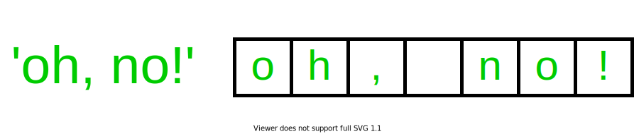

## Type `str`

The `str` type represents text. `str` is short for "string", the general computer
science term used to refer to text. They are called strings because they
string together a sequence of individual characters.

Because of this, you can visualize strings as a sequence of individual
characters that are ordered, with each character getting its own "box" / space.

To create a string, you type the text you want, surrounded on either
side by quotes.
You need quotes to properly create the string and let Python know that the
expression you are typing corresponds to text, since otherwise Python will
try to interpret it as code.

For example,

You can add punctuation to strings as well. This includes spaces, exclamation
points, commas, periods, and the like. You can also add digits. Similar to
text, each character gets its own box.

Note how even though you are required to add quotes to the beginning and
end of the string to delimit it and tell Python where the text starts and stops,
the quotes are **not** part of the string value that Python evaluates it to
under the hood. The underlying string only contains the characters inside of the
string, since at that point Python knows that every character there corresponds
to the same string.


In most cases, you can use single quotes or double quotes to delimit the string,
and Python does not care - it will evaluate to the same value regardless
of which is chosen. As an example, try running `'Hello' == 'Hello'` in the
Python shell - Python will give you back the boolean `True`.


Like most things in programming, strings are case sensitive. So `'ABC'` and
`'abc'` are two different strings according to Python, and comparing them with
`==` yields False.

One special example of a string is the empty string - that is, a string
with no text / characters inside of it. The empty string can be created
with quotes with nothing inside of it, i.e. `''`.

## Operators

We will go more in-depth in string operators when we cover our lesson on
strings, but some basic operations on strings include:

| Operator | Action                                                                                                                                                                                                                                                                                             | Example                                                                      |
|----------|----------------------------------------------------------------------------------------------------------------------------------------------------------------------------------------------------------------------------------------------------------------------------------------------------|------------------------------------------------------------------------------|
| `a + b`  | String concatenation. `a + b` evaluates to a new string where `b` is stuck to the end of `a`.                                                                                                                                                                                                      | `'abc' + 'xyz'` evaluates to `'abcxyz'`.                                     |
| `a in b` | Evaluates to `True` if string `a` is contained within string `b`, and False otherwise.  To be contained within the other string, a contiguous subsequence of the character boxes in `b`  must match the character boxes in `a`. If this evaluates to `True`, we say `a` is a **substring** of `b`. | `'hi' in 'hi there!'` evaluates to True. `'x' in 'abc'` evaluates to False.  |

